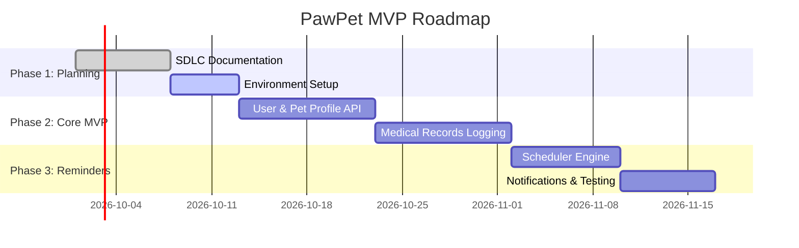

# 6. Planning / Pre-Development

This document outlines pre-development preparations, software engineering workflows, repository structure, and contribution conventions for **PawPet**.

---

## 1. Pre-Development Checklist

- [x] Problem Definition finalized (`problem_definition.md`)
- [x] Functional and Non-Functional Requirements defined (`requirements_analysis.md`)
- [x] Project Feasibility Study completed (`feasibility_study.md`)
- [x] System Architecture and Database Schemas designed (`system_design.md`)
- [x] Core Algorithms and Pseudocode mapped (`algorithm_design.md`)
- [ ] Development Environment and Repository setup (`planning_pre_development.md`)

---

## 2. Recommended Repository Layout

```text
sdlc/
├── README.md                       # Master index & SDLC repo overview
├── problem_definition.md           # 1. Problem & Solution Scope
├── requirements_analysis.md        # 2. Functional & Non-Functional Specs
├── feasibility_study.md            # 3. Technical & Financial Viability
├── system_design.md                # 4. Architecture & DB Schema
├── algorithm_design.md             # 5. Core Pseudocode & Logic
└── planning_pre_development.md     # 6. Development Workflow & Guidelines
```

---

## 3. Git Workflow & Collaboration Guidelines

### Branching Model
- `main` / `master`: Production-ready releases.
- `develop`: Main development branch for integrating feature branches.
- `feature/<feature-name>`: Individual feature work (e.g., `feature/pet-profile-crud`, `feature/email-reminder`).
- `fix/<bug-name>`: Bug fix branches.

### Pull Request & Review Process
1. **Fork or Clone:** Contributors fork the `sdlc` repository or clone directly.
2. **Branch Creation:** Create a descriptive feature branch from `develop`.
3. **Commit Messages:** Follow conventional commit messages (`feat: add pet vaccination model`, `docs: update system design schema`).
4. **Pull Request (PR):** Open a PR targeting `develop`. Include:
   - Summary of changes.
   - Reference to associated requirements (e.g., satisfies `FR-3.1`).
   - Screenshots or log evidence.
5. **Code Review:** Require at least 1 peer approval before merging.

---

## 4. Milestone Timeline & Sprints



---

## 5. Development Tools & Standards

- **Version Control:** Git & GitHub / GitLab
- **Linter & Formatter:** ESLint + Prettier (JavaScript/TypeScript) or Flake8/Black (Python)
- **CI/CD Pipeline:** GitHub Actions running linting, build checks, and automated tests on PR creation.
