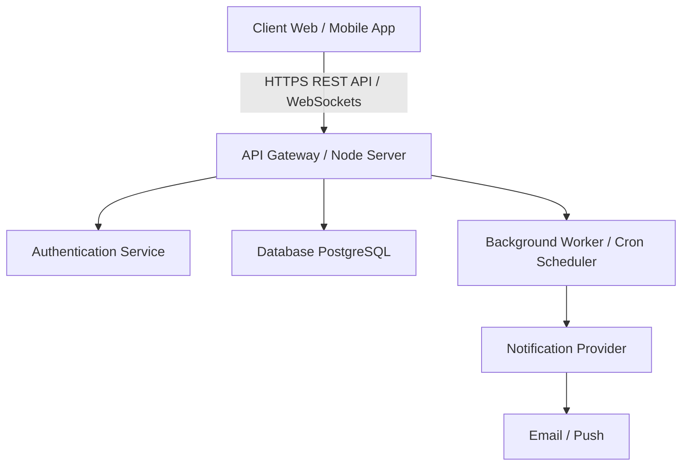

# 4. System Design

This document details the architectural structure, database schemas, component data flow, and API endpoints for **PawPet**.

## 1. High-Level Architecture

PawPet follows a multi-tier Client-Server Architecture:

## 2. Database Schema (Entity-Relationship Overview)

### Users Table (`users`)
| Column | Type | Constraints | Description |
| :--- | :--- | :--- | :--- |
| `id` | UUID | Primary Key | Unique user ID |
| `email` | VARCHAR(255) | Unique, Not Null | Account email address |
| `password_hash` | VARCHAR(255) | Not Null | Encrypted password |
| `full_name` | VARCHAR(100) | Not Null | User's full name |
| `created_at` | TIMESTAMP | Default NOW() | Account creation date |

### Pets Table (`pets`)
| Column | Type | Constraints | Description |
| :--- | :--- | :--- | :--- |
| `id` | UUID | Primary Key | Unique pet identifier |
| `owner_id` | UUID | Foreign Key -> `users(id)` | Owner user ID |
| `name` | VARCHAR(100) | Not Null | Pet name |
| `species` | VARCHAR(50) | Not Null | Dog, Cat, Bird, etc. |
| `breed` | VARCHAR(100) | Nullable | Pet breed |
| `date_of_birth` | DATE | Nullable | Date of birth |
| `weight_kg` | DECIMAL(5,2) | Nullable | Weight in kilograms |

### Medical Records Table (`medical_records`)
| Column | Type | Constraints | Description |
| :--- | :--- | :--- | :--- |
| `id` | UUID | Primary Key | Record identifier |
| `pet_id` | UUID | Foreign Key -> `pets(id)` | Associated pet |
| `category` | ENUM | Not Null | VACCINE, CHECKUP, SURGERY, MEDICATION |
| `title` | VARCHAR(150) | Not Null | Name of vaccine/treatment |
| `date_administered`| DATE | Not Null | Date recorded |
| `notes` | TEXT | Nullable | Additional details |

### Reminders Table (`reminders`)
| Column | Type | Constraints | Description |
| :--- | :--- | :--- | :--- |
| `id` | UUID | Primary Key | Reminder identifier |
| `pet_id` | UUID | Foreign Key -> `pets(id)` | Associated pet |
| `title` | VARCHAR(150) | Not Null | Reminder event title |
| `due_date` | TIMESTAMP | Not Null | Target alert timestamp |
| `status` | ENUM | Default 'PENDING' | PENDING, SENT, COMPLETED |

## 3. Core API Endpoints

### Authentication API
- `POST /api/auth/register` — Register a new pet owner account.
- `POST /api/auth/login` — Authenticate user and return token.

### Pet API
- `GET /api/pets` — List all pets belonging to the logged-in user.
- `POST /api/pets` — Add a new pet profile.
- `GET /api/pets/:id` — Fetch details for a specific pet.

### Medical Record & Reminder API
- `POST /api/pets/:id/records` — Log a new medical or vaccination record.
- `GET /api/pets/:id/records` — Get history of records for a pet.
- `POST /api/pets/:id/reminders` — Schedule a new reminder.
- `GET /api/reminders/upcoming` — Fetch all pending reminders for the logged-in user.
